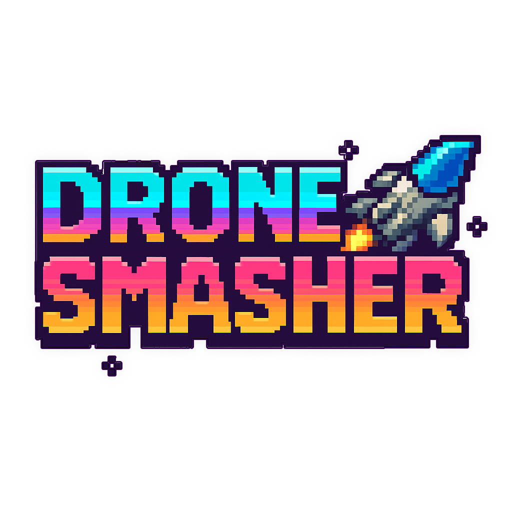
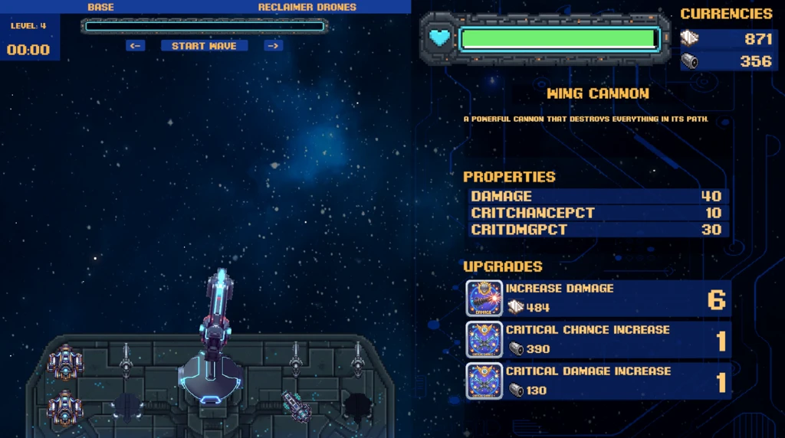
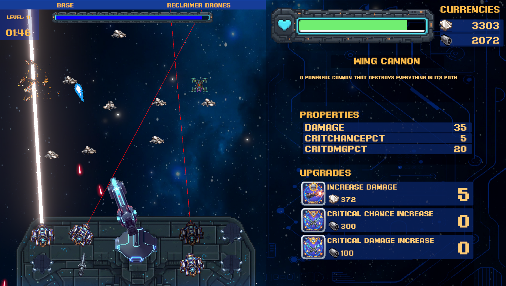

<h1 align="center">
   
  
   
</h1>

## Description
Defend your base against swarms of drones in this thrilling endless tower defense game. Upgrade your defenses, place powerful cannons, and deploy gatherer drones to collect resources. Strengthen your base, and see how long you can survive against increasingly challenging waves!
- Genre: Tower defense, strategy, clicker
- Platform: Windows

## Features
- Main Cannon - can be upgraded to deal more damage while mouse clicking
- Supporting Cannons - purchase various cannons from store to strengthen your firepower
- Gatherer drones - purchase gatherers to retrieve more resources from enemy wrecks
- Multiple currencies with different drop rates
- Save system

### Tools
- **Unity** - game engine
- **PhotoPea** - graphics
- **Piskel** - animations

### Free resources
- [OpenGameArt] - free sprite's and 2D graphics
- [itch.io] - free assets and graphic bundles

### Image Gallery

[OpenGameArt]: https://opengameart.org/
[itch.io]: https://itch.io/game-assets/free
